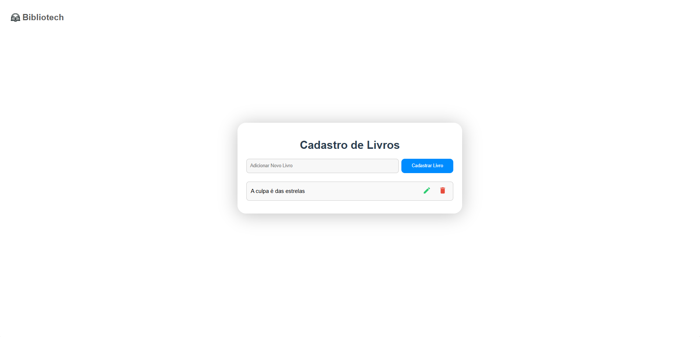

# Cadastro de Livros



Este projeto é um CRUD (Create, Read, Update, Delete) para cadastro de livros, desenvolvido com React e Firebase. Ele permite que os usuários adicionem, visualizem, editem e excluam informações sobre livros.

## Funcionalidades

- Adicionar um novo livro
- Visualizar a lista de livros cadastrados
- Editar informações de um livro existente
- Excluir um livro

## Tecnologias Utilizadas

- React
- Firebase

## Como Executar o Projeto

1. Clone o repositório:
   ```bash
   git clone https://github.com/seu-usuario/seu-repositorio.git
